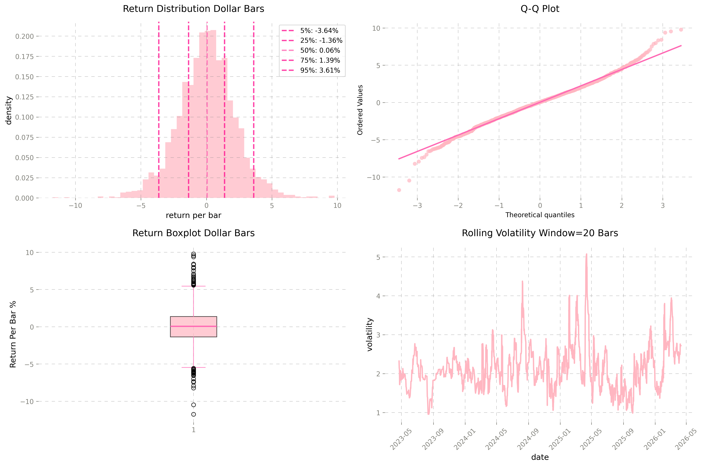
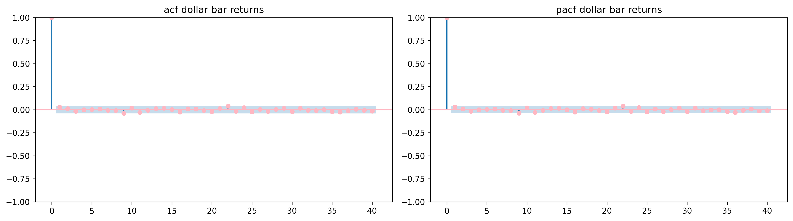
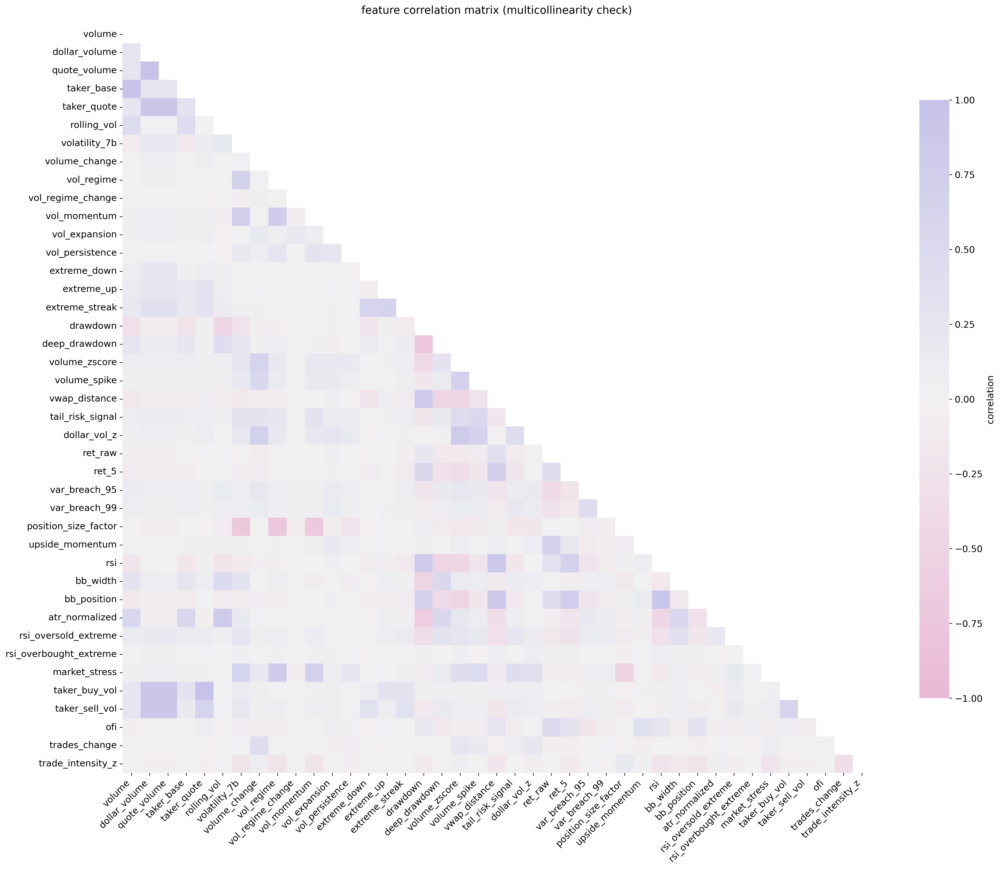
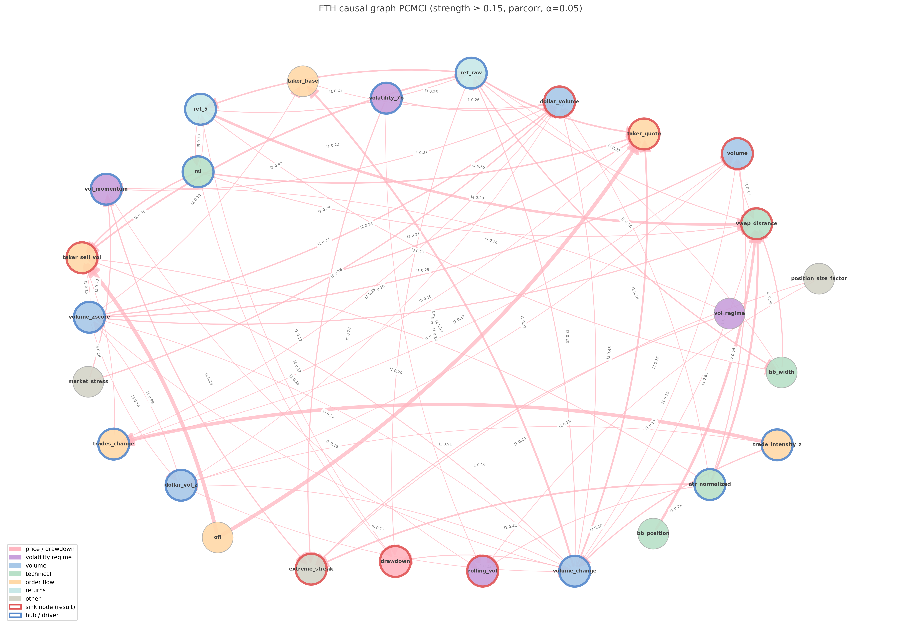
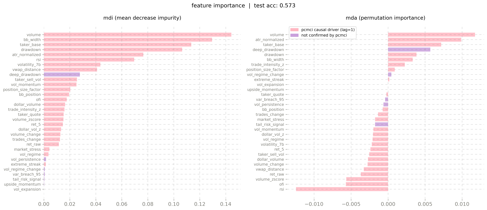
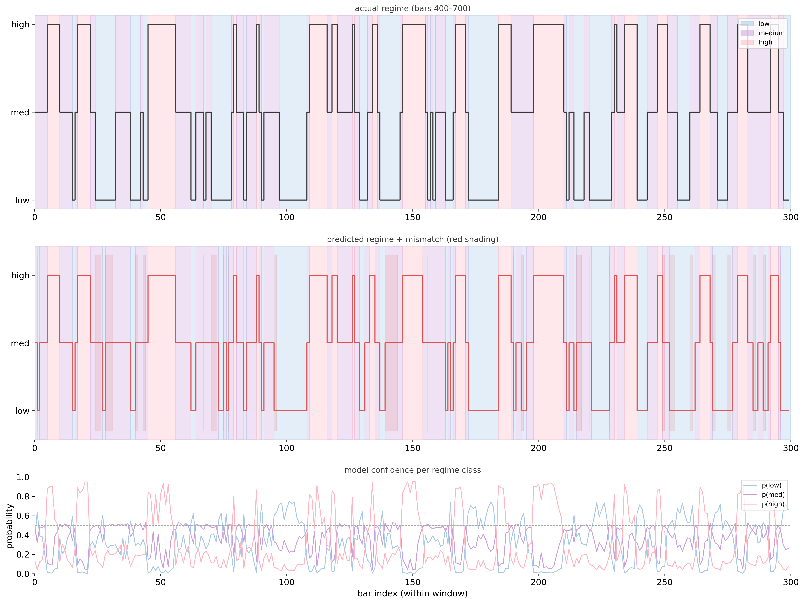
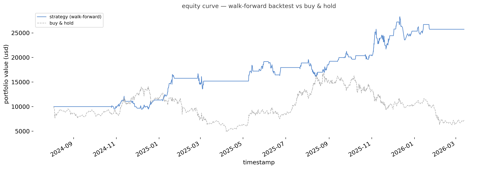

# UNDER CONSTRUCTION

# De Prado ML Framework with Causal Discovery: Regime Prediction in ETH Dollar Bars

## Overview

Marcos López de Prado argues that most machine learning models in finance fail not because of model complexity, but due to **spurious features**, statistical relationships that do not reflect the true data-generating process.

This project implements de Prado's ML framework on ETH/USDT, extended with causal discovery as a methodological guardrail. The system predicts **volatility regimes** for Volatility targeting, Strategy switching, Risk overlays.

To address limitations of time-based sampling, the analysis is conducted on **dollar bars** ($500M threshold), which sample observations based on traded value. This reduces heteroskedasticity, improves serial independence of returns, and aligns data with actual market activity.

---

### Research Question

*DDoes causal feature selection improve the predictability of volatility regimes in ETH dollar bars under purged cross-validation?*

### Methodology

- **Dollar Bar Construction** $500M threshold, 2431 bars over 3 years, validated via Durbin-Watson (1.95) and Ljung-Box (p > 0.4)
- **Feature Engineering** volatility, volume, drawdown, technical and order
  flow features, all ADF-tested for stationarity (36/36 passed)
- **Correlation Analysis** multicollinearity hygiene via clustering (threshold 0.85), not feature selection
- **Causal Discovery** PCMCI map feature dependency structure and identify true drivers vs downstream nodes
- **Triple Barrier Labeling** PT = 1.5x ATR, SL = 1.0x ATR, max hold = 20 bars
- **Random Forest with Purged K-Fold CV** n=5 folds, embargo=1%, prevents temporal leakage
- **MDI/MDA Feature Importance** cross-referenced with causal graph to validate signal vs noise


### Key Finding

Causal discovery and MDI/MDA produced **mutually explanatory results**. RSI ranked 3rd by MDI (in-sample importance) but last by MDA (out-of-sample). PCMCI explained the mechanism: RSI is a pure downstream node driven by `vwap_distance`, `bb_width`, and `drawdown`, it carries no independent predictive signal. MDI was deceived by its correlation with genuine drivers. This cross-validation is the primary methodological contribution of the hybrid framework.


### Results (out-of-sample, purged CV)

| Metric | Value |
|---|---|
| Regime model accuracy | 0.632 ±0.020 |
| Lift over majority baseline | +19.5pp |
| AUC low / med / high | 0.859 / 0.723 / 0.913 |
| Average regime persistence | 70.9% |
| Return model AUC (global) | 0.587 |
| Return model AUC (high regime) | 0.658 |
| Backtest Sharpe (walk-forward) | 1.735 |
| Backtest max drawdown | -22.01% |

**Regime persistence (P(next \| current)):**

| | →low | →med | →high |
|---|---|---|---|
| low | 0.721 | 0.262 | 0.018 |
| med | 0.169 | 0.672 | 0.160 |
| high | 0.012 | 0.250 | 0.738 |

**Regime classifier feature importance (MDI, mean across folds):**

| Feature | Importance |
|---|---|
| `market_stress` | 0.386 |
| `volatility_7b` | 0.269 |
| `bb_position` | 0.112 |
| `vol_persistence` | 0.104 |


---

## ETH Distribution Characteristics

- **Neutral with negligible positive bias mean return** (0.03%) with median (0.06%) indicates weak bullish drift in the sample period
- **Moderate volatility** (2.21% per bar), more stable than time bars due to event-based sampling
- **Near-symmetric distribution** (skewness -0.02) indicates no strong directional asymmetry
- **Low excess kurtosis** (1.36) suggests extreme events typical for crypto returns



### Tail Risk Profile

- **VaR 95%: -3.64%** moderate downside risk per dollar-activity event
- **VaR 99%: -5.45%** rare but meaningful tail losses under high-activity regimes

### Serial Independence Validation

Dollar bars are theoretically more i.i.d. than time bars. This was validated empirically:

- **Durbin-Watson: 1.94** near-perfect, no lag-1 autocorrelation
- **Ljung-Box lag 10: p = 0.65** no autocorrelation across first 10 lags
- **Ljung-Box lag 20: p = 0.83** holds across 20 lags

This confirms the core motivation for dollar bars: returns are statistically independent, satisfying the assumption most ML models require.



---

## Feature Engineering

Features are grouped by domain and mapped to distributional properties of the return series:

| Domain | Features | Rationale |
|---|---|---|
| Volatility | `volatility_7b`, `vol_regime`, `vol_momentum`, `vol_expansion` | Activity-conditioned regime signals |
| Risk | `drawdown`, `deep_drawdown`, `var_breach_95/99`, `tail_risk_signal`, `position_size_factor` | Tail risk per unit of traded value |
| Extremes | `extreme_streak`, `upside_momentum` | Non-linear shock detection |
| Technical | `bb_width`, `bb_position`, `atr_normalized`, `vwap_distance`, `rsi` | Latent market state proxies |
| Volume / Flow | `volume_change`, `volume_zscore`, `dollar_vol_z`, `dollar_volume` | Information flow and activity intensity |
| Order Flow | `ofi`, `taker_quote`, `taker_sell_vol`, `trades_change`, `trade_intensity_z` | Aggressive order pressure and trade composition |
| Returns | `ret_raw`, `ret_5` | Short-term momentum signals |
| Composite | `market_stress`, `rolling_vol` | Multi-signal regime indicators |

All 36 features passed stationarity validation. Continuous features were confirmed via ADF test (all p < 0.05). Binary and near-constant features were excluded from ADF and validated separately, none were dropped.
---

## Correlation Analysis

Correlation analysis identifies redundant feature groups and controls multicollinearity.
It serves as a structural filter, not a measure of predictive importance. Feature
ranking and final selection are performed post-training via MDI/MDA.

Three clusters were identified at a threshold of 0.85:

- **Cluster 1:** `volume`, `taker_base` (corr 0.98), both measure raw traded quantity,
  near-identical information content
- **Cluster 2:** `dollar_volume`, `taker_quote`, `taker_sell_vol` (max corr 0.90), all
  encode dollar-denominated flow; buy and sell volume sum to total dollar volume by
  construction
- **Cluster 3:** `vwap_distance`, `rsi`, `bb_position` (max corr 0.89), all encode
  normalized price location relative to a reference (VWAP, momentum oscillator,
  volatility bands), producing high lag=0 redundancy

Correlation alone cannot determine which features to drop. PCMCI resolves this:
`rsi` and `bb_position` accumulate past price action and carry memory across bars,
giving them genuine outgoing causal links to `ret_raw` and `ret_5`. `vwap_distance`
is a snapshot of where price landed, no memory, no outgoing return. Within Clusters 1 and 2, representative features are retained and duplicates resolved via PCMCI causal link strength.

  
   
---
## Causal Discovery (PCMCI)

Causal discovery via PCMCI (Tigramite, ParCorr, α=0.05, lags 1–5) was used to map
directional dependencies between features, separating true drivers from downstream
nodes before model training.

**Purpose:** Identify genuine predictive signals vs. construction artifacts. Features
with high MDI/MDA but purely downstream or self-correlated structure are flagged as
noise candidates.

894 significant causal links detected. The majority are construction artifacts,
features computed from the same underlying series:
- `ofi → taker_sell_vol / taker_quote` (0.98): by definition, ofi is the normalized
  difference of those two quantities
- `ret_raw / ret_5 / rsi / bb_position → vwap_distance` (0.86–0.99): all price-location
  measures, high lag=0 redundancy persists into lag=1
- `dollar_vol_z / volume_zscore → dollar_volume` (0.83): z-scores of dollar_volume
- `trade_intensity_z → trades_change` (0.91): both derived from `trades`
- `ret_5 ↔ ret_raw` (0.69–0.91): multi-bar vs. single-bar return overlap
- `volume_change → taker_base / taker_quote / taker_sell_vol` (0.45–0.69):
  volume_change is derived directly from `volume`

**Genuine causal links to return targets (actionable signals):**
- `volume_change → ret_raw` (lag 1, 0.23): strongest real signal, abnormal volume
  growth directly predicts the primary return target
- `bb_width → ret_raw` (lag 1, 0.16): band expansion precedes directional move
- `rsi → ret_5` (lag 1–2): momentum extreme predicts multi-bar return direction

**Genuine cross-domain links (non-artifact, but targets are sinks):**
- `rsi / ret_raw → drawdown` (lag 1, 0.78 / 0.88): momentum extremes and recent
  losses predict cumulative drawdown, real mechanism, but drawdown is a sink node
- `atr_normalized / vol_momentum / vol_regime → extreme_streak` (lag 1, 0.24–0.42):
  regime-level vol predicts tail event persistence, extreme_streak is a sink node
- `market_stress → vol_momentum` (lag 1, 0.28): composite stress drives vol
  trajectory, vol_momentum is a neutral node, not a return target

**Correlation vs. causation:**

Correlation analysis flagged `rsi`, `bb_position`, and `vwap_distance` as
near-duplicates (corr > 0.85). PCMCI resolves this: `rsi` and `bb_position`
carry memory across bars with genuine outgoing links to `ret_5`; `vwap_distance`
is a result node only, caused by all three, with no outgoing return links.
`vwap_distance` is confirmed for deletion.

**Deletion candidates (no causal link to ret_raw / ret_5):**
- `vwap_distance`: pure sink, caused by rsi / bb_position / ret_raw
- `dollar_volume`: pure sink driven by volume_zscore, dollar_vol_z, volume_change
- `taker_quote`, `taker_sell_vol`: sinks by construction via ofi and volume_change
- `taker_base`: peripheral sink, no return links
- `rolling_vol`: near-pure autocorrelation, no outgoing return links
- `extreme_streak`: sink, receives from vol / atr, no return links
- `drawdown`: driven by rsi / ret_raw, result node, not a predictor

Could be considered removing: `ofi`, `trades_change`, `trade_intensity_z`
(all route into construction-artifact sinks rather than return targets).

**Interpretation:** PCMCI results are used as a structural filter.
Binary features were excluded from PCMCI; only continuous/ordinal features tested.


   
---

## Triple Barrier Labeling & Feature Importance

**Triple Barrier Labeling** (de Prado) replaces naive return-direction labels with
structurally sound targets:

- **Upper barrier:** Profit target at 1.5x ATR
- **Lower barrier:** Stop-loss at 1.0x ATR
- **Vertical barrier:** Maximum hold of 20 bars

Split: 1423 train / 590 test bars, 20-bar embargo at the boundary to prevent leakage.
Target balance (train): 0.55, near-balanced, no resampling required.

**MDI vs MDA: The Core Diagnostic**



A Random Forest was trained on all stationary features with triple barrier labels as
target. Two importance measures were computed and cross-referenced with causal
discovery results:

- **MDI (Mean Decrease Impurity):** In-sample, computed from tree structure. Fast but
  biased toward high-cardinality and correlated features.
- **MDA (Mean Decrease Accuracy):** Out-of-sample permutation importance on held-out
  data. Slower but honest.

The gap between MDI and MDA revealed the key finding of this stage:

| Feature | MDI Rank | MDA | Verdict |
|---|---|---|---|
| `volume` | 1 | negative | noise, no causal return link |
| `bb_width` | 2 | positive | genuine signal |
| `taker_base` | 3 | positive | genuine signal |
| `rsi` | 6 | negative | noise, causally downstream |
| `vwap_distance` | 8 | negative | noise, confirmed sink node |

RF1 (all features): train 0.701 / test 0.573. The 12.8pp gap signals overfitting.
22 features were dropped: 20 with negative MDA, 2 combined weak (`upside_momentum`,
`vol_expansion`).

**Final Feature Set (10 features, MDI/MDA validated):**

| Feature | Causal Status |
|---|---|
| `bb_width` | direct return link (ret_raw) |
| `atr_normalized` | driver of extreme_streak |
| `drawdown` | sink in PCMCI, but MDI/MDA confirmed |
| `volume` | weak return link in PCMCI |
| `taker_base` | peripheral in PCMCI, MDA confirmed |
| `position_size_factor` | neutral node |
| `trade_intensity_z` | routes to artifact sinks |
| `extreme_streak` | sink node, MDA confirmed |
| `vol_regime_change` | binary, MDA confirmed |
| `deep_drawdown` | binary, MDA confirmed |

RF2 (final features): train 0.693 / test 0.573, identical test performance with
less than half the features. The 22 dropped features contributed exclusively to
in-sample overfitting, zero test signal.

Notable conflict between methods: `drawdown`, `extreme_streak`, and `taker_base`
were flagged as PCMCI sink nodes but survived MDA selection. Conversely,
`volume_change` and `rsi` showed direct return links in PCMCI but were eliminated
by negative MDA. Both signals are retained as evidence, the conflict is documented,
not resolved.

**Purged K-Fold Cross Validation**

Standard k-fold leaks future information at fold boundaries due to rolling feature
windows. Purged CV removes training samples whose window overlaps the test period,
plus an embargo buffer of 1% of bars (20 bars) after each test fold.

| Fold | Train | Test | Accuracy | AUC |
|---|---|---|---|---|
| 1 | 1607 | 406 | 0.539 | 0.552 |
| 2 | 1587 | 406 | 0.559 | 0.606 |
| 3 | 1587 | 406 | 0.537 | 0.585 |
| 4 | 1587 | 406 | 0.537 | 0.608 |
| 5 | 1604 | 409 | 0.582 | 0.582 |
| **mean** | | | **0.551 ±0.020** | **0.587 ±0.023** |

Naive 70/30 test accuracy was 0.573. Purged CV mean is 0.551, a leakage inflation
of +2.2pp, consistent with rolling feature windows bleeding across the split boundary.
The purged estimate is the honest number.

AUC of 0.587 on triple barrier labels represents a genuine predictive edge and a
meaningful improvement over the initial full-feature baseline (0.533). The gain is
attributed to feature selection: 22 noise features removed, signal density per
feature increased. Accuracy of 0.551 at a baseline of 0.518 is modest (+3.3pp above
chance) but consistent across all five folds with no outlier fold, confirming the
edge is structural rather than fold-specific.

---

## Regime Detection & Strategy

Volatility regimes were identified using a Hidden Markov Model (HMM) and labeled
as three discrete states: low (0), medium (1), high (2). The regime classifier
predicts the next bar's regime state using a dedicated 10-feature set.

**Regime distribution:** low 27.7% / medium 43.8% / high 28.6%.
Majority-class baseline: 43.8%.

**Persistence structure:**

| Current → Next | Low | Medium | High |
|---|---|---|---|
| Low | 0.721 | 0.262 | 0.018 |
| Medium | 0.169 | 0.672 | 0.160 |
| High | 0.012 | 0.250 | 0.738 |

Regimes are strongly self-persistent (diagonal 0.67–0.74). The classifier
exploits this directly, it predicts whether the current state continues,
not price direction.

**Purged CV results:**

| Fold | Accuracy | AUC (low) | AUC (med) | AUC (high) |
|---|---|---|---|---|
| 1 | 0.596 | 0.852 | 0.701 | 0.908 |
| 2 | 0.655 | 0.849 | 0.715 | 0.925 |
| 3 | 0.613 | 0.839 | 0.739 | 0.908 |
| 4 | 0.638 | 0.889 | 0.746 | 0.922 |
| 5 | 0.659 | 0.867 | 0.713 | 0.900 |
| **mean** | **0.632** | **0.859 ±0.020** | **0.723 ±0.019** | **0.913 ±0.011** |

Lift over baseline: **+19.5pp**, consistent across all folds. Low and high
regimes are nearly perfectly separable (AUC 0.859 / 0.913). Medium is harder
(0.723), structurally ambiguous as the transition state between extremes.



Two systematic failure modes are visible: a one-bar lag at transitions, and
systematic underrepresentation of medium regime predictions. Model confidence
rarely exceeds 0.7 except during sustained high-volatility blocks where
`p(high)` briefly spikes above 0.8. `market_stress` and `volatility_7b`
account for 66% of MDI importance, confirming regimes are fundamentally
volatility states.

**Regime-conditioned return prediction:**

Two approaches were tested to combine regime and return models:

*Approach 1, regime probabilities as features:*

| Metric | Global | Regime-conditioned | Delta |
|---|---|---|---|
| Accuracy | 0.551 | 0.564 | +0.014 |
| AUC | 0.587 | 0.596 | +0.009 |

Marginal improvement. The global model already captures implicit regime
structure through `vol_regime_change` and `deep_drawdown`.

*Approach 2, separate model per regime:*

| Regime | Bars | AUC | Delta vs global |
|---|---|---|---|
| Low | 562 | 0.542 | -0.045 |
| Medium | 889 | 0.553 | -0.033 |
| High | 581 | 0.658 | +0.071 |

This is the key finding: **predictive edge is concentrated entirely in the
high-volatility regime.** The global AUC of 0.587 is a weighted average,
strong signal in high-volatility periods diluted by noise in low and medium
regimes. The high-regime model (AUC 0.658, std 0.069) is consistent across
all folds with no outlier.

**Walk-forward backtest:**

The regime classifier and return model are combined into a single strategy:
active only in predicted high-volatility regimes, with ATR-based barriers
matching the triple barrier labeling scheme. Both models are re-fitted every
50 bars on past data only, no future information leaks into any prediction.
HMM Viterbi decoding is limited to the current window to prevent look-ahead
in state assignment.

Signal logic: long when `prob_high > 0.55` and `ret_prob > 0.55`, short
when `ret_prob < 0.45`. Stop-loss at 1.0x ATR, take-profit at 1.5x ATR.

| Metric | Strategy | Buy & Hold |
|---|---|---|
| Total return | 157.33% | -27.71% |
| Sharpe ratio | 1.735 | 0.057 |
| Max drawdown | -22.01% | -64.98% |
| Total trades | 94 | — |
| Win rate | 61.7% | — |
| Avg trade return | 1.134% | — |



**Limitations:** 94 trades over 1.5 years is statistically thin. The
benchmark period (Aug 2024 - Mar 2026) was a bear market for ETH, which
amplifies relative performance. Hyperparameters were selected on the same
data period, no fully independent out-of-sample period exists. This
backtest is a proof-of-concept, not a validated trading system.
---


## Usage
```bash
git clone https://github.com/pynat/causality
pip install -r requirements.txt
jupyter notebook inference_and_causality.ipynb
```